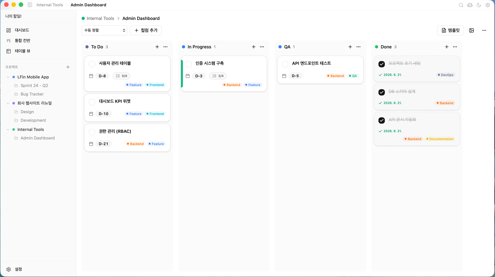

<div align="center">

# Kanban

**빠르고, 오프라인으로 동작하는 데스크톱 칸반 보드.**

Tauri 2, React 19, SQLite로 만들었습니다. 계정도, 인터넷도 필요 없습니다. 데이터는 내 컴퓨터에만 저장됩니다.

[](#라이선스)
[](https://tauri.app)
[](https://react.dev)

[English](./README.md) | [한국어](./README.ko.md)

<!-- TODO: 스크린샷 추가 -->
<!--  -->

</div>

---

## 주요 기능

**다양한 뷰** — 원하는 방식으로 작업하세요.
- 드래그 앤 드롭 칸반 보드
- 필터/정렬이 가능한 테이블 뷰
- 프로젝트 전체를 상태별로 보는 통합 뷰
- 프로젝트 요약과 긴급 항목을 보여주는 대시보드

**풍부한 카드 편집** — 포스트잇 그 이상입니다.
- Tiptap 리치 텍스트 에디터 (코드 블록, 링크, 체크리스트)
- 하위 작업과 진행률 추적
- 태그, 색상 라벨, 마감일 뱃지
- 보드·프로젝트 간 카드 이동

**키보드 중심 워크플로우**
- `Cmd+K` 명령 팔레트 (전문 검색)
- `Cmd+N` 새 카드, `Cmd+S` 백업, `Cmd+\` 사이드바 토글
- 커스텀 단축키 설정

**커스터마이징**
- 라이트 / 다크 / 시스템 테마
- 10가지 강조색 (앱 전체에 적용)
- 보드 배경: 8가지 그라디언트 프리셋 또는 이미지 업로드
- 카드 템플릿으로 반복 작업 간소화

**데이터 소유권**
- 로컬 SQLite — 데이터가 외부로 나가지 않습니다
- 60초마다 자동 백업
- 수동 백업 및 복원

**다국어 지원**
- 한국어, 영어 기본 포함
- 기능별 네임스페이스 구조로 언어 추가가 쉽습니다

## 기술 스택

| 영역 | 기술 |
|------|------|
| 데스크톱 | Tauri 2 (Rust) |
| 프론트엔드 | React 19, TypeScript 5.7 (strict) |
| 라우팅 | TanStack Router |
| 데이터 패칭 | TanStack React Query |
| 상태 관리 | Zustand |
| UI | Radix UI + shadcn/ui + Tailwind CSS 4 |
| 에디터 | Tiptap 2 |
| 드래그 앤 드롭 | Atlassian Pragmatic DnD |
| 가상 스크롤 | TanStack Virtual |
| 다국어 | i18next |
| 데이터베이스 | SQLite (rusqlite, bundled) |
| 빌드 | Vite 6 |

## 시작하기

### 사전 준비

- [Node.js](https://nodejs.org/) (LTS)
- [Rust](https://www.rust-lang.org/tools/install)
- OS별 [Tauri 빌드 환경](https://v2.tauri.app/start/prerequisites/)

### 개발 모드

```bash
# 의존성 설치
npm install

# 데스크톱 앱 개발 모드 실행
npm run tauri dev

# 프론트엔드만 개발 서버로 실행 (포트 1420)
npm run dev
```

### 빌드

```bash
# 프로덕션 빌드
npm run tauri build
```

빌드 결과물은 `src-tauri/target/release/bundle/`에 생성됩니다.

## 프로젝트 구조

```
kanban/
├── src/                    # React 프론트엔드
│   ├── components/
│   │   ├── board/          # 칸반 보드 뷰
│   │   ├── card-detail/    # 카드 편집 모달
│   │   ├── dashboard/      # 프로젝트 개요
│   │   ├── layout/         # 앱 셸, 사이드바, 명령 팔레트
│   │   ├── settings/       # 앱 설정
│   │   ├── shared/         # 공용 컴포넌트
│   │   ├── table/          # 테이블 뷰
│   │   ├── ui/             # shadcn/ui 기본 컴포넌트
│   │   └── unified/        # 프로젝트 전체 칸반
│   ├── hooks/              # Tauri API 연동 React Query 훅
│   ├── lib/                # Tauri API 브릿지, 유틸리티
│   ├── locales/            # 번역 파일 (en, ko)
│   ├── stores/             # Zustand 상태 관리
│   └── styles/             # 글로벌 CSS, Tailwind 테마
├── src-tauri/              # Rust 백엔드
│   ├── src/
│   │   ├── commands/       # Tauri IPC 핸들러
│   │   └── db/             # SQLite 연결, 마이그레이션
│   └── tests/              # 통합 테스트
└── AGENTS.md               # AI 에이전트 문서 (계층 구조)
```

## 데이터 모델

```
Projects → Boards → Columns → Cards → Subtasks
                                 └──→ Tags (다대다)
```

Column에는 상태 카테고리(`todo`, `in_progress`, `done`, `other`)가 있고, 통합 뷰와 대시보드 집계의 기반이 됩니다.

## 기여하기

기여를 환영합니다. 변경 사항은 범위를 좁게 유지하고, 제출 전에 테스트해 주세요.

```bash
# Rust 테스트 실행
cd src-tauri && cargo test

# 프론트엔드 타입 체크
npm run build
```

## 라이선스

MIT

---

<div align="center">

오프라인 도구를 선호하는 사람들을 위해 만들었습니다.

</div>
