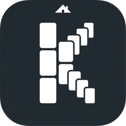

<div align="center">



# Kabin

**Your cozy, offline Kanban board.**

Cabin + Kanban. A fast desktop app where your tasks stay on your machine — no account, no internet, no compromise.

[](#license)
[](https://tauri.app)
[](https://react.dev)

[English](./README.md) | [한국어](./README.ko.md)

<!-- TODO: Add screenshot -->
<!--  -->

</div>

---

## Features

**Multiple Views** — Work the way you prefer.
- Board view with drag-and-drop columns and cards
- Table view with multi-field filtering and sorting
- Unified view across all projects by status category
- Dashboard with project summaries and urgent items

**Rich Card Editing** — More than sticky notes.
- Tiptap rich text editor with code blocks, links, and task lists
- Subtasks with progress tracking
- Tags, color labels, and deadline badges
- Move cards across boards and projects

**Keyboard-First Workflow**
- `Cmd+K` command palette with full-text search
- `Cmd+N` new card, `Cmd+S` backup, `Cmd+\` toggle sidebar
- Customizable keyboard shortcuts

**Customization**
- Light / Dark / System theme
- 10 accent colors with app-wide tinting
- Board backgrounds: 8 gradient presets or custom image upload
- Card templates for repeated workflows

**Data Ownership**
- Local SQLite database — nothing leaves your machine
- Auto-backup every 60 seconds
- Manual backup and restore

**Internationalization**
- English and Korean included
- Namespace-by-feature translation structure for easy extension

## Tech Stack

| Layer | Technology |
|-------|-----------|
| Desktop | Tauri 2 (Rust) |
| Frontend | React 19, TypeScript 5.7 (strict) |
| Routing | TanStack Router |
| Data Fetching | TanStack React Query |
| State | Zustand |
| UI | Radix UI + shadcn/ui + Tailwind CSS 4 |
| Editor | Tiptap 2 |
| Drag & Drop | Atlassian Pragmatic DnD |
| Virtualization | TanStack Virtual |
| i18n | i18next |
| Database | SQLite (rusqlite, bundled) |
| Build | Vite 6 |

## Getting Started

### Prerequisites

- [Node.js](https://nodejs.org/) (LTS)
- [Rust](https://www.rust-lang.org/tools/install)
- [Tauri prerequisites](https://v2.tauri.app/start/prerequisites/) for your OS

### Development

```bash
# Install dependencies
npm install

# Run in development mode (opens desktop window)
npm run tauri dev

# Frontend-only dev server (port 1420)
npm run dev
```

### Build

```bash
# Production build
npm run tauri build
```

The built app will be in `src-tauri/target/release/bundle/`.

## Project Structure

```
kanban/
├── src/                    # React frontend
│   ├── components/
│   │   ├── board/          # Kanban board views
│   │   ├── card-detail/    # Card editor modal
│   │   ├── dashboard/      # Project overview
│   │   ├── layout/         # App shell, sidebar, command palette
│   │   ├── settings/       # App settings
│   │   ├── shared/         # Reusable components
│   │   ├── table/          # Table view
│   │   ├── ui/             # shadcn/ui primitives
│   │   └── unified/        # Cross-project kanban
│   ├── hooks/              # React Query hooks for Tauri API
│   ├── lib/                # Tauri API bridge, utilities
│   ├── locales/            # i18n translations (en, ko)
│   ├── stores/             # Zustand state
│   └── styles/             # Global CSS, Tailwind theme
├── src-tauri/              # Rust backend
│   ├── src/
│   │   ├── commands/       # Tauri IPC handlers
│   │   └── db/             # SQLite connection, migrations
│   └── tests/              # Integration tests
└── AGENTS.md               # AI agent documentation (hierarchical)
```

## Data Model

```
Projects → Boards → Columns → Cards → Subtasks
                                 └──→ Tags (many-to-many)
```

Columns have status categories (`todo`, `in_progress`, `done`, `other`) that power the unified view and dashboard aggregations.

## Contributing

Contributions are welcome. Please keep changes focused and test before submitting.

```bash
# Run Rust tests
cd src-tauri && cargo test

# Type check frontend
npm run build
```

## License

MIT

---

<div align="center">

Made with care for people who prefer their tools offline. Welcome to your Kabin.

</div>
